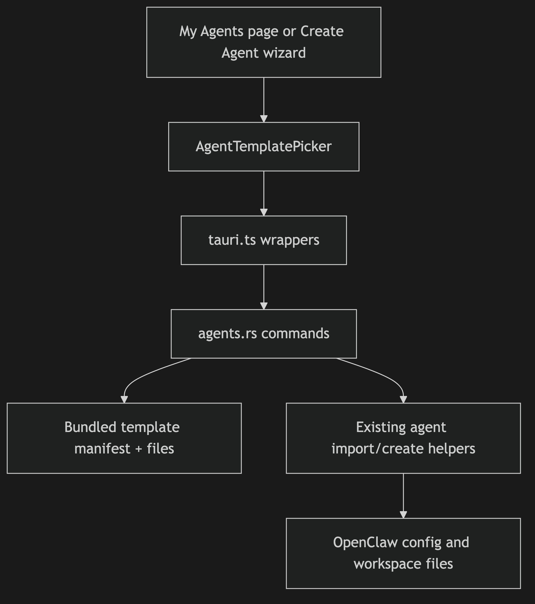
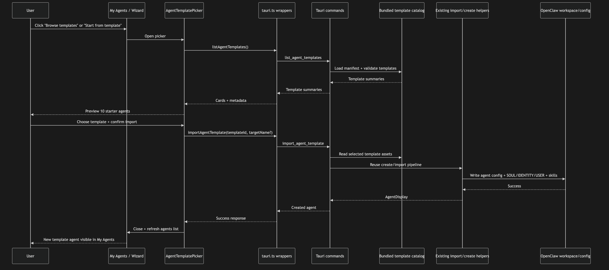

# Issue #170: Add 10 Template Agents for Users to Import

## Summary
Add a first-party template-agent catalog to the desktop app so users can import one of 10 curated starter agents instead of beginning from a blank agent. The implementation should reuse the existing agent import/create pipeline where possible and expose template entry points from **My Agents** and the create-agent wizard.

## Root Cause Analysis
The current desktop experience has two gaps:

1. **There is no built-in template catalog.** The agents page supports creating a blank agent and importing a zip, but it does not ship with any curated starter agents.
2. **The template UX is only partially scaffolded.** `CreateAgentWizard.tsx` already renders a conditional **Start from template** link when `clawHubReachable` is true, but the link has no behavior and there is no template data model, picker UI, or backend command to materialize a template into a real agent.

That leaves users with a blank-slate flow even though the product docs/ADRs already point toward templated agent creation. Issue #170 also introduces a product-level change in direction: instead of waiting for a community-powered ClawHub agent-template catalog, MultiClaw now needs a guaranteed set of 10 curated templates available immediately.

## Proposed Solution
Implement a **bundled template catalog** for the desktop app and route imports through the existing agent creation/import primitives.

Recommended shape:

- Store 10 curated template bundles plus a lightweight metadata manifest in the desktop app source tree.
- Add backend commands to:
  - list available template summaries for the UI
  - import a selected template into the user’s OpenClaw environment
- Reuse existing agent-import behavior as much as possible so template imports inherit the same file-writing, model-restoration, skill-writing, and validation paths already used for zip imports.
- Add a reusable **template picker** dialog/sheet that can be opened from:
  - the **My Agents** empty state / header CTA
  - the **Start from template** link in `CreateAgentWizard.tsx`
- Keep the catalog behind a small abstraction so the source can later evolve from “bundled templates” to “bundled + ClawHub” without rewriting the UI.

A practical implementation path is to package templates in the same logical structure already supported by agent export/import (`manifest`, `SOUL.md`, `IDENTITY.md`, optional `USER.md`, config excerpt, skills). That avoids inventing a second agent-template format and lowers backend risk.

## Files to Modify
| File | Change |
|------|--------|
| `apps/desktop/src/components/agents/AgentList.tsx` | Add template CTA(s) to the hero and/or empty state so users can browse templates from **My Agents**. |
| `apps/desktop/src/components/agents/CreateAgentWizard.tsx` | Replace the inert **Start from template** link with real picker-opening behavior and template prefill/import flow. |
| `apps/desktop/src/lib/tauri.ts` | Add typed IPC wrappers for listing/importing bundled templates. |
| `apps/desktop/src/lib/types.ts` | Add shared TypeScript types for template summaries/details/import responses. |
| `apps/desktop/src/stores/agentStore.ts` | Optionally add store helpers for template import/reload flow if the UI should stay store-driven. |
| `apps/desktop/src-tauri/src/commands/agents.rs` | Add `list_agent_templates` and `import_agent_template` commands, reusing existing import/create helpers. |
| `apps/desktop/src-tauri/src/lib.rs` | Register new Tauri commands. |
| `apps/desktop/src/locales/en.json` | Add strings for template catalog, cards, import CTA, errors, and success toasts. |
| `apps/desktop/e2e/features/agents.feature` | Add/upgrade scenarios covering browsing templates and importing one into My Agents. |
| `apps/desktop/e2e/steps/agents.ts` | Implement step definitions for template browsing/import flows. |
| `apps/desktop/src/components/agents/__tests__/CreateAgentWizard.test.tsx` | Extend tests to cover template entry-point behavior. |
| `apps/desktop/src/components/agents/__tests__/AgentList.test.tsx` | Cover empty-state/header template CTA rendering and interactions. |
| `apps/desktop/src/components/agents/__tests__/AgentImport.test.tsx` | Reuse or mirror conflict/success expectations if template import shares the same post-import UX. |

## New Files
| File | Purpose |
|------|---------|
| `apps/desktop/src/components/agents/AgentTemplatePicker.tsx` | Reusable modal/sheet that lists the 10 template agents, shows preview metadata, and triggers import/prefill actions. |
| `apps/desktop/src/components/agents/__tests__/AgentTemplatePicker.test.tsx` | Unit coverage for template listing, selection, loading, error, and import actions. |
| `apps/desktop/src-tauri/src/openclaw/agent_templates.rs` | Rust helper module for reading bundled template metadata/assets and delegating import through existing agent import helpers. |
| `apps/desktop/src-tauri/templates/index.json` | Catalog manifest for the 10 bundled templates, including id, name, emoji, summary, model, and recommended skills. |
| `apps/desktop/src-tauri/templates/<template-id>/...` | One directory per curated template containing `SOUL.md`, `IDENTITY.md`, optional `USER.md`, and any bundled skill/reference assets. |

## Implementation Steps
1. **Define the template source format.** Decide whether bundled templates live as export-style bundles or as a directory-per-template manifest + markdown files; prefer the format that reuses the current import pipeline with the fewest new code paths.
2. **Create the 10 curated template assets.** Adapt the requested roles (Code Review Expert, Documentation Writer, Test Engineer, etc.) into app-owned template files with stable IDs, emoji, summaries, and optional recommended skills.
3. **Add Rust template-catalog helpers.** Implement a loader that enumerates the bundled templates, validates required files, and returns display-safe metadata for the UI.
4. **Add Tauri commands.** Expose commands to list template summaries and import a chosen template by ID; unknown or corrupted templates should fail with friendly errors.
5. **Reuse existing import/create internals.** Route template materialization through `create_agent_impl` plus existing workspace-writing/import helpers so model, identity, user profile, and skills land in the same on-disk layout as normal imports.
6. **Build the template picker UI.** Add a dedicated picker component with loading, empty, error, and success states. Each card should show emoji, title, purpose, and recommended-skill hints.
7. **Wire entry points.** Open the picker from the My Agents page and from the wizard’s **Start from template** link. Decide whether wizard selection should prefill draft state or directly import a template-created agent; document the chosen behavior in code comments/tests.
8. **Handle name-conflict behavior.** Reuse the rename/overwrite pattern already present in zip import so template imports do not silently fail or clobber existing agents.
9. **Add i18n and polish.** Move all new labels, descriptions, button text, and errors into `en.json` and follow existing accessibility/dialog patterns.
10. **Add automated coverage.** Write Rust tests for template discovery/import, frontend unit tests for picker flows, and E2E coverage for browsing/importing a template from My Agents.

## Test Strategy
- **Rust unit tests:**
  - catalog loader returns the 10 expected templates
  - invalid/missing template assets fail clearly
  - importing a template writes `SOUL.md`, `IDENTITY.md`, optional `USER.md`, and skills in the correct workspace layout
  - imported model/subagent metadata is restored exactly like zip import
- **Frontend unit tests:**
  - template CTA renders in the agents page empty state and/or hero
  - picker shows loading, list, and error states
  - selecting a template invokes the correct IPC wrapper
  - wizard link opens the picker and follows the expected prefill/import behavior
  - success closes the picker and refreshes the agents list
- **Integration tests:**
  - store/UI flow reloads agents after template import
  - conflict handling matches existing import behavior
- **Edge cases:**
  - duplicate template import name
  - unknown template ID
  - template contains a model unavailable on the target setup
  - missing/corrupt template asset in packaged app
  - importing when there are zero existing agents

## Risks & Mitigations
| Risk | Mitigation |
|------|------------|
| **ADR/product mismatch:** ADR-39 says templates come from ClawHub, while Issue #170 asks for bundled templates. | Introduce a template-catalog abstraction so bundled templates are the first provider, not a one-off implementation. That preserves a migration path back to ClawHub-backed templates later. |
| **Duplicated import logic creates drift from zip import.** | Reuse `create_agent_impl`, `write_imported_workspace_files`, and existing config/model restoration logic instead of inventing a second file-writing path. |
| **Bundled content becomes hard to maintain.** | Keep all 10 templates in a manifest-driven catalog with a consistent directory structure and add validation tests so broken assets fail in CI. |
| **Template import UX conflicts with current wizard semantics.** | Decide early whether templates prefill the wizard or create a finished agent directly; document one rule and cover it with unit/E2E tests. |
| **Asset packaging/runtime path issues in Tauri.** | Use compile-time embedding or a well-defined packaged-assets path and add an automated test that reads template assets in the same way production code will. |
| **Large scope from 10 content-rich templates plus UI/backend work.** | Land the framework first (catalog + picker + import path), then add the 10 template payloads using a shared checklist/template schema to keep content production consistent. |

## Diagrams

### Bundled Template Catalog Reusing Existing Agent Import Pipeline

### User Flow for Importing a Template Agent

