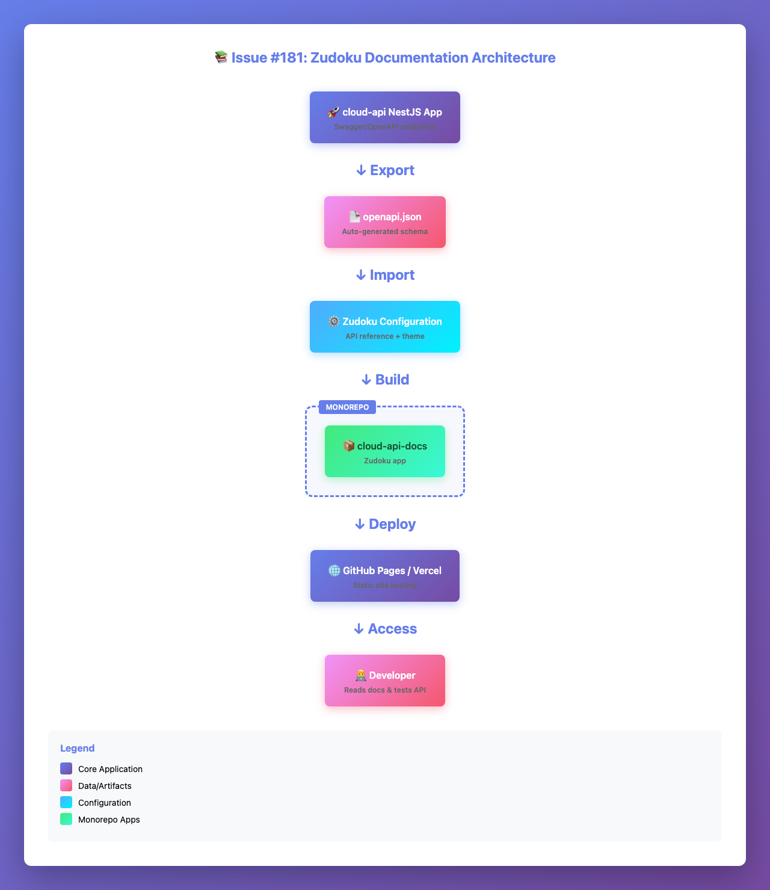
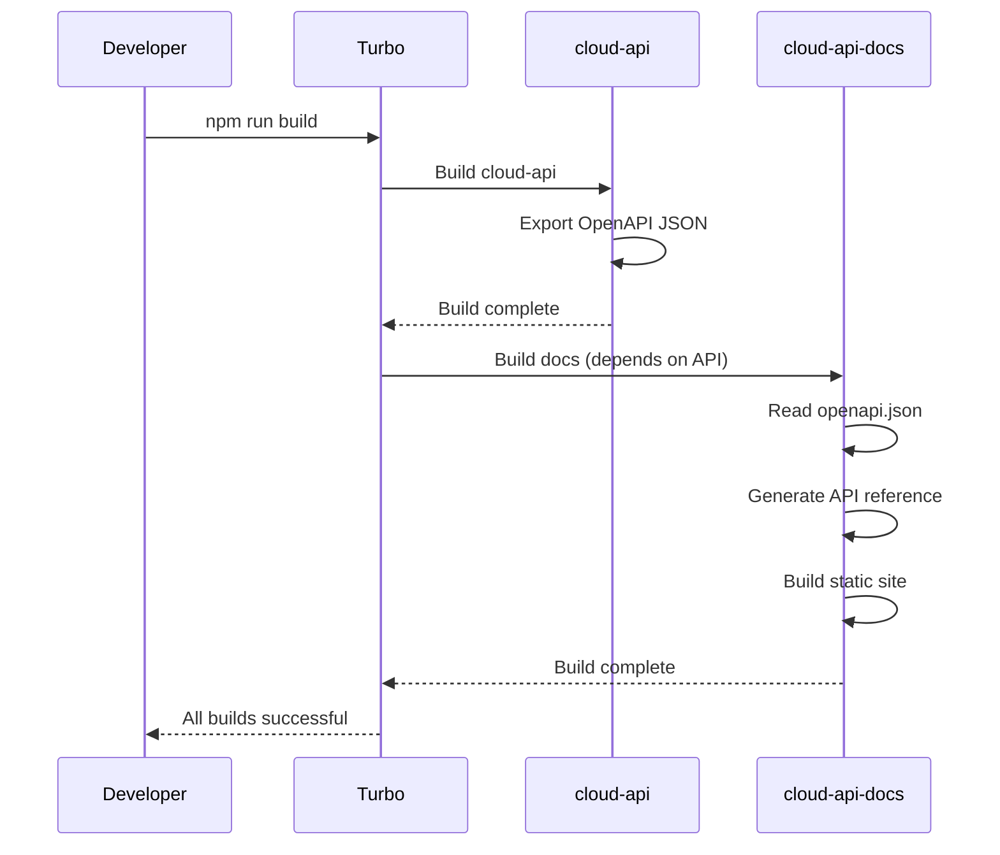
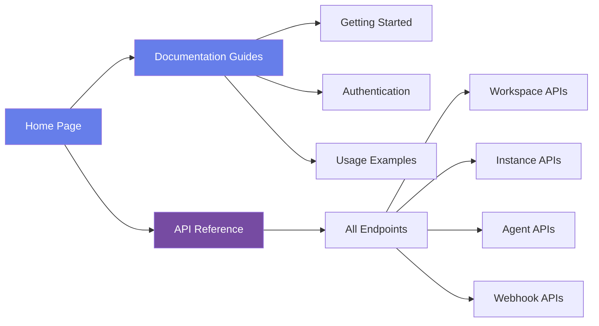

# Issue #181: Create automated API documentation with Zudoku for cloud-api

## Summary
Create a comprehensive, automated documentation site for `@multiclaw/cloud-api` using Zudoku (https://zudoku.dev), integrating OpenAPI schema export from the existing NestJS/Swagger setup and building a branded developer portal with API reference and usage guides.

## Root Cause Analysis
**Current State:**
- Cloud API has Swagger/OpenAPI documentation available at `/api/v1/docs` endpoint
- Documentation is only accessible when the API server is running
- No standalone, versioned documentation site exists
- No integration with developer guides or authentication documentation

**Desired State:**
- Static, deployable documentation site using Zudoku
- Auto-generated API reference from OpenAPI schema
- Integrated guides (Getting Started, Authentication, Usage)
- MultiClaw branding (logo, colors, theme)
- Build integration with monorepo (Turbo)

## Proposed Solution
1. Create new Zudoku app at `apps/cloud-api-docs` in the monorepo
2. Add OpenAPI schema export endpoint to cloud-api (in addition to Swagger UI)
3. Configure Zudoku to consume the exported OpenAPI JSON file
4. Create documentation pages (mdx) for guides
5. Apply MultiClaw branding via Zudoku theme configuration
6. Integrate with Turbo build system
7. Add build scripts to export OpenAPI and build docs

## Files to Modify
| File | Change |
|------|--------|
| `apps/cloud-api/src/main.ts` | Add OpenAPI JSON export endpoint at `/api/v1/docs-json` |
| `apps/cloud-api/package.json` | Add script to export OpenAPI schema to file |
| `turbo.json` | Add build pipeline dependency for docs app |
| `apps/cloud-api-docs/zudoku.config.ts` | **NEW** - Zudoku configuration with OpenAPI integration |
| `apps/cloud-api-docs/package.json` | **NEW** - Zudoku dependencies and scripts |
| `apps/cloud-api-docs/docs/introduction.mdx` | **NEW** - Getting started guide |
| `apps/cloud-api-docs/docs/authentication.mdx` | **NEW** - Authentication guide |
| `apps/cloud-api-docs/docs/usage.mdx` | **NEW** - Usage examples guide |
| `apps/cloud-api-docs/public/multiclaw-logo.svg` | **NEW** - MultiClaw logo for branding |

## New Files
| File | Purpose |
|------|---------|
| `apps/cloud-api-docs/` | New Zudoku documentation app directory |
| `apps/cloud-api-docs/zudoku.config.ts` | Zudoku configuration (OpenAPI, theme, navigation) |
| `apps/cloud-api-docs/package.json` | Package configuration with zudoku dependency |
| `apps/cloud-api-docs/tsconfig.json` | TypeScript configuration |
| `apps/cloud-api-docs/docs/introduction.mdx` | Getting started documentation |
| `apps/cloud-api-docs/docs/authentication.mdx` | Authentication and authorization guide |
| `apps/cloud-api-docs/docs/usage.mdx` | Usage examples and tutorials |
| `apps/cloud-api-docs/public/multiclaw-logo.svg` | MultiClaw branding logo |
| `apps/cloud-api/scripts/export-openapi.ts` | Script to export OpenAPI schema to JSON file |

## Implementation Steps

### Phase 1: OpenAPI Export Setup (cloud-api)
1. Add `/api/v1/docs-json` endpoint to `main.ts` that serves raw OpenAPI JSON
2. Create `scripts/export-openapi.ts` to generate `openapi.json` file
3. Add `npm run export-openapi` script to `apps/cloud-api/package.json`
4. Test that OpenAPI JSON is correctly exported

### Phase 2: Zudoku App Creation
1. Create `apps/cloud-api-docs/` directory structure:
   ```
   apps/cloud-api-docs/
   ├── docs/
   │   ├── introduction.mdx
   │   ├── authentication.mdx
   │   └── usage.mdx
   ├── public/
   │   └── multiclaw-logo.svg
   ├── zudoku.config.ts
   ├── package.json
   └── tsconfig.json
   ```

2. Create `zudoku.config.ts` with:
   - OpenAPI file reference (`../cloud-api/openapi.json`)
   - Navigation structure
   - MultiClaw theme (colors, logo)
   - Site metadata

3. Create `package.json` with:
   - `zudoku` dependency
   - `dev`, `build`, `preview` scripts
   - `generate-openapi` script to pull from cloud-api

4. Create documentation pages (mdx):
   - **introduction.mdx**: Overview, quick start, architecture
   - **authentication.mdx**: JWT tokens, Bearer auth, examples
   - **usage.mdx**: Common operations, code examples, best practices

### Phase 3: Monorepo Integration
1. Update `turbo.json` to add docs build pipeline
2. Add `@multiclaw/cloud-api-docs` to workspace
3. Create root-level script to build all docs
4. Test build chain: cloud-api build → export OpenAPI → docs build

### Phase 4: Branding & Polish
1. Add MultiClaw logo to `public/` directory
2. Configure Zudoku theme colors (indigo/purple gradient matching existing brand)
3. Add custom CSS if needed
4. Test responsive design and dark mode

### Phase 5: Testing & Validation
1. Run `npm run build` in docs app
2. Verify API reference renders correctly
3. Test all navigation links
4. Validate OpenAPI endpoints match actual API
5. Check branding and visual consistency

## Test Strategy
- **Unit tests**: Verify OpenAPI export script generates valid JSON
- **Integration tests**: Build docs app with exported OpenAPI file
- **Visual tests**: Screenshot key pages (API reference, guides)
- **Edge cases**:
  - Empty/invalid OpenAPI file handling
  - Missing logo or assets
  - Build without cloud-api dependency

## Risks & Mitigations
| Risk | Mitigation |
|------|------------|
| Zudoku version incompatibility with monorepo setup | Pin exact zudoku version, test in isolation first |
| OpenAPI schema changes break docs build | Add OpenAPI export to cloud-api build pipeline, version lock |
| Branding assets not available | Use placeholder logo, create simple SVG based on existing brand colors |
| Build performance impact | Use Turbo caching, only rebuild docs when OpenAPI changes |
| CORS issues with external OpenAPI URL | Use local file reference (`type: "file"`) instead of URL |

## Diagrams

### Architecture Flow



### Build Pipeline


### Documentation Site Structure


## Acceptance Criteria
- [x] Zudoku docs app builds successfully (`npm run build` in `apps/cloud-api-docs`)
- [x] API reference auto-generated from OpenAPI (visible at `/api` route)
- [x] Documentation guides created (Introduction, Authentication, Usage)
- [x] MultiClaw branding applied (logo, colors, theme)
- [x] Build scripts added to monorepo (Turbo integration)
- [x] OpenAPI export automated (script or endpoint)

## References
- Zudoku Documentation: https://zudoku.dev
- Existing Swagger: `/api/v1/docs` (when cloud-api is running)
- Zudoku Config Reference: https://zudoku.dev/docs/configuration/overview
- API Reference Config: https://zudoku.dev/docs/configuration/api-reference
